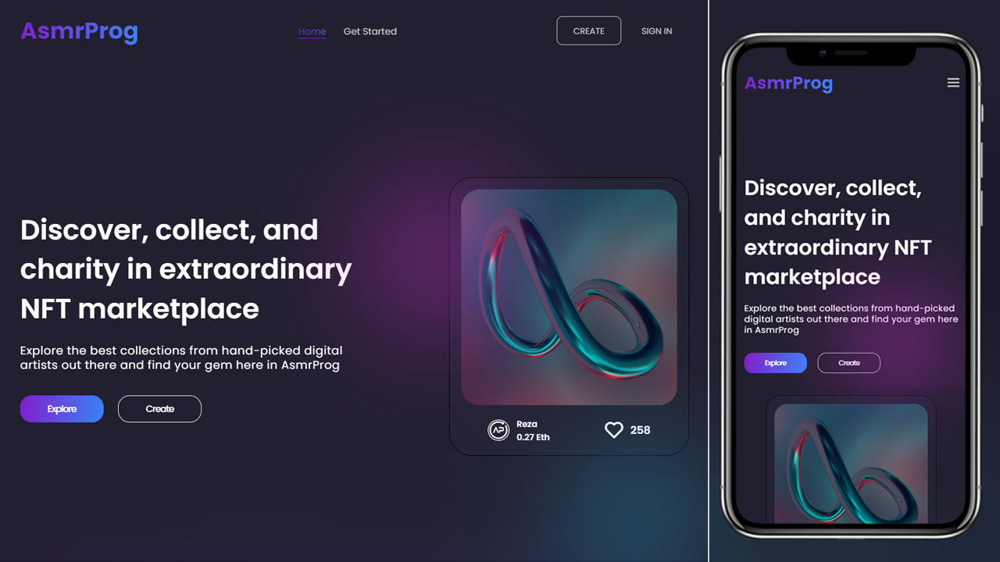

# Responsive NFT Landing Page

In this tutorial ([Open in Youtube](https://youtu.be/0mPBAmgGkEs)),  I'm going to show you how to use modern HTML, CSS, and JavaScript to create a completely responsive nft landing page. We'll be using CSS linear-gradient, CSS Grid, CSS Flexbox, Media queries for our responsive design, and CSS  transitions and animations (keyframes) for some cool animation effects.

# Screenshot
Here we have project screenshot :

